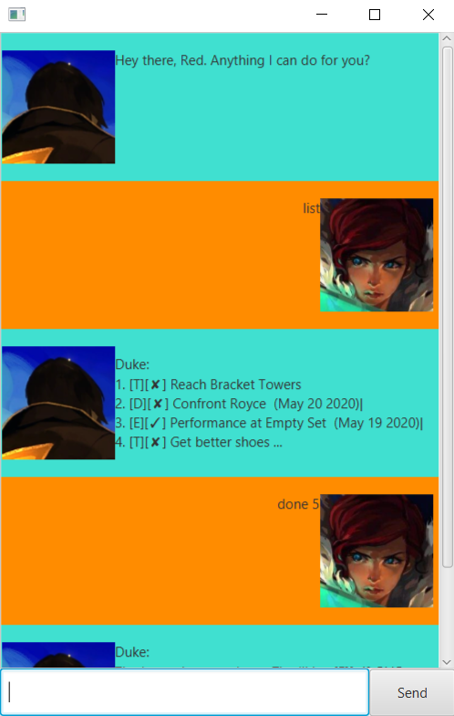
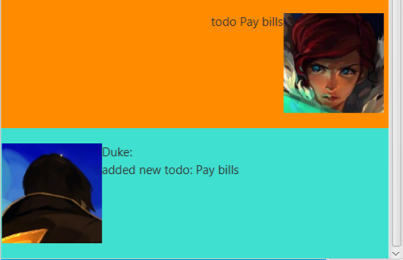
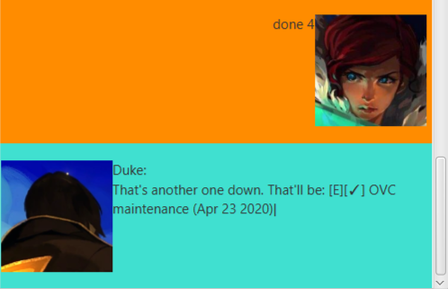
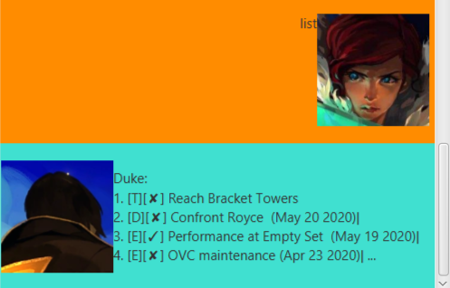
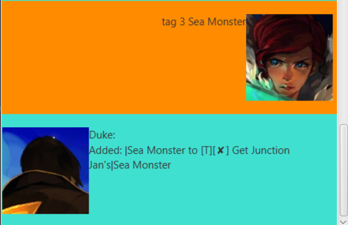

# Duke User Guide

## Overview
Duke is a personal chatbot, meant to keep track of *your* personal tasks! For this particular chatbot, the overall themeing is a nod to Transistor by Supergiant Games. Images are taken from official in-game and promotional artworks

## Starting Duke
1. Download and locate the Duke program's jar file in File Explorer.
2. Open command line (via typing "cmd" in Windows search). Alternatively, run Terminal if you are on MacOS.
3. Locate the jar file in command line or Terminal, and run the following command:
    > java -jar duke-0.2-all.jar

## Features
1. Add a Task
2. Mark as Done
3. Delete a Task
4. List All Tasks
5. Find by Keyword
6. Add Tag to a Task
7. Exit Duke
 
## Usage
### 1.  Add a Task
There are three types of tasks available, with the following commands:
1. todo
2. event
3. deadline

### 1. `todo` - add a todo task
A to-do task is one with only task details.

Format: `todo <description>`

Example of usage:`todo retrieve the Transistor`

Expected outcome: 

### 2. `event` - add an event task
An event task is one with task details as well as a "do at" date. Note that the backslash "/" is required.

Format: `event 
 </yyyy-mm-dd>`

Example of usage: `event Performance at the Empty Set/2020-05-18`

### 3. `deadline` - add a deadline task
A deadline task is one with task details as well as a "do by" date. Note that the backslash "/" is required.

Format: `deadline 
 </yyyy-mm-dd>`

Example of usage: `deadline Climb Bracket Towers /2020-05-20`

Expected outcome: 

### 2. Mark as Done
By providing an index, the task with that index will be marked as done, indicated with a tick symbol.

Format: `done <index>`

Example of usage: `done 2`

Expected outcome: 

### 3. Delete a Task
By providing an index, the task with that index in the task list will be deleted.

Format: `delete <index>`

Example: `delete 2`

Expected outcome: 

### 4. List All Tasks
Lists out all tasks currently in Duke, along with a reference index.

Format: `list`

Expected outcome: 

### 5. Find by Keyword
By providing a keyword, all tasks containing that keyword will be found and listed out.

Format: `find <description>`

Example: `find Towers`

Expected outcome: 

### 6. Add Tag to a Task
By providing an index and a phrase, the task with that index will be tagged with the phrase.

Format: `tag <index> <tag details>`

Example: `tag 4 sea monster`

Expected outcome: 

### 7. Exit Duke
Once you're done, you can exit Duke. Any task data in Duke will be saved, so next time you run Duke you can continue where you left off!

Format: `bye`

Expected outcome: 

